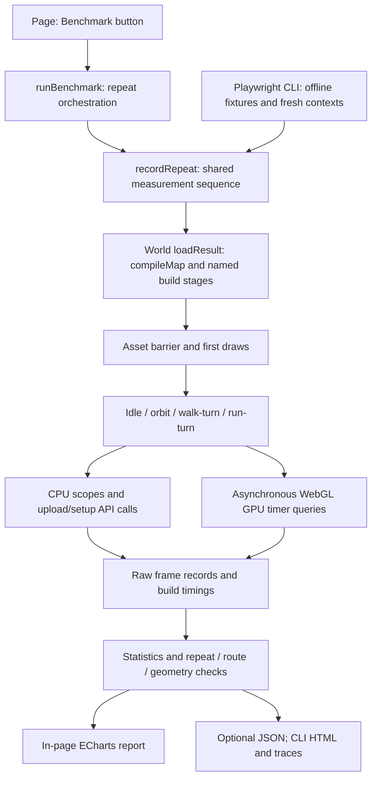

# Benchmark architecture

The map lab has two callers and one shared measurement runner. The page shows results immediately, with optional JSON download. The CLI adds fresh browser contexts, offline fixtures, response hashes and saved artifacts. Both use the same rendering and movement APIs.



## Responsibilities

All paths below are relative to `qa/map-lab/`.

| Component | Owns |
| --- | --- |
| `ui/map-generator.js` | Query session, control locking, cancellation, generation and report display |
| `benchmark/replay-config.js` | Warmup/frame/repeat limits and scenario selection |
| `benchmark/benchmark-runner.js` | Repeat sequence, readiness, profiler lifetime, summaries and metadata |
| `render/map-world.js` | Renderer, camera, simulation, walking queries and scene ownership; no benchmark imports |
| `benchmark/map-benchmark.js`, `scenarios.js` | Development adapter, temporary scope wrappers, deterministic replay and versioned scenario registry |
| `benchmark/scene-metadata.js`, `scene-coverage.js` | Environment/settings and visible geometry audit, collected outside measured frames |
| `pipeline/map-build.js` | Disposable scene compilation and named build stages |
| `pipeline/building-match.js` | Building identity validation, sampled overlap and explicit rejection evidence shared by both views |
| `render/prop-placement.js`, `render/feature-visibility.js` | Rigid prop placement on visible walking surfaces at build and supporting-layer changes; records estimated bases and placement logs |
| `benchmark/frame-profiler.js` | CPU scopes, asynchronous GPU queries, upload/setup call instrumentation and cleanup |
| `benchmark/frame-report.js` | Statistics, source fingerprinting and comparison/coverage validation |
| `benchmark/frame-chart-data.js` | Non-overlapping CPU stack segments and representative p95 frame selection |
| `benchmark/frame-report-view.js` | Shared in-page/exported report UI and detailed tables |
| `benchmark/frame-charts.js` | ECharts legend toggles, activity filtering, duration bars and timeline zoom |
| `qa/map-lab/tests/map-frame-profile.mjs` (repository root) | CLI browser lifecycle, fixture loading, asset hashes, optional traces and saved reports |

## Measurement boundaries

Source acquisition records duration, retries and outcomes separately. Each benchmark repeat then rebuilds the selected data, measures named CPU stages, waits for tracked assets, records first draws, and runs warmup plus measured frames for each scenario. Warmup and first draws do not enter steady-state activity summaries. UI repeats share one context; CLI repeats use fresh contexts. Neither guarantees a cold driver cache.

CPU ground and collision scopes sit inside simulation; simulation, controls and render submission sit inside the loop. Chart stacks remove those overlaps and use one actual frame at the loop's 95th percentile, rather than adding unrelated stage percentiles. The GPU bar shows its own 95th percentile. CPU/GPU bars compare durations; GPU start timestamps and actual overlap intervals are not captured. The red line is the 16.67 ms target for 60 FPS, not guaranteed compositor headroom.

GPU texture sampling remains part of total shading time. Texture/buffer upload columns measure CPU API calls, not separate GPU transfer durations. Unsupported, disjoint or otherwise missing GPU samples are unavailable, never zero. The timeline lets users inspect outliers and frame cadence separately.

Charts load after profiling completes. Their observers and ECharts instances are disposed before another run. The runner drains or discards pending GPU queries and restores instrumented APIs on completion, cancellation and failure. Hidden-page UI benchmarks cancel.

## Logs and artifacts

| Output | Contents | Lifetime |
| --- | --- | --- |
| Source responses | Queries, raw features, original tags and provenance | In-memory session; explicit per-source downloads |
| Merge log | Policy version, source members, selected attributes, conflicts and coverage | In-memory session; explicit download |
| Generation log | Settings, acquisition timings, build stages, issues and fallback reasons | In-memory session; explicit download |
| Benchmark report (schema 4) | Raw frames, summaries, builds, environment, settings, route/geometry identities and input fingerprint | Displayed in-page; optional JSON download |
| CLI artifacts | JSON/HTML reports, screenshots, optional Chrome traces and hashed responses | Ignored `.tmp/map-lab/` |

These are exports, not an incremental dependency graph or per-stage artifact cache. A Make/Gradle-style integration is deferred; no bespoke task/cache framework is being built.

## Extension points and current limits

Add future geometry/material stages to `pipeline/map-build.js` with named marks. Register asynchronous assets before profiling and include experiment settings in scene metadata. Add new simulation scopes in the development adapter around actual runtime methods and preserve their nesting when reporting. Add future render passes inside the measured draw scope.

New geographic scenes use the existing query/load API; the CLI accepts `--scene path/to/scene.json`. New routes live in the development registry, without changing the renderer:

```js
const harness = createMapBenchmark(world, {scenarios: {
  ...DEFAULT_SCENARIOS,
  overhead: {version: 1, create(world) {
    world.fit(true);
    return () => null; // No movement; step(timeSeconds) may return walking input.
  }},
}});
const report = await runBenchmark(harness, {options: {modes: ['overhead']}});
```

Scenario setup resets its state; `step` must depend on fixed replay time and saved input, not wall-clock time or randomness. Increment its version when the route changes. Reports retain scenario versions, source fingerprint, render settings, merge policy version and hardware/browser conditions. CLI reports also hash source and served assets. JSON exports and labeled CLI files provide history; there is no results database or dashboard yet. A different engine/game scene needs an adapter exposing equivalent lifecycle, input, render and metadata operations.

The current target is untextured geometry. See [WebGL research, isolation and review](./WEBGL-BENCHMARK-REVIEW.md) for release packaging, measurement overhead and remaining validity limits. GPU optimization, texture work, chunked/worker generation, and local ramp shaping remain separate follow-ups. This harness measures the lab only; using it in the real game requires a world adapter and deterministic routes. See [profiling instructions](./MAP-PROFILING.md) and [the documentation index](./README.md).
