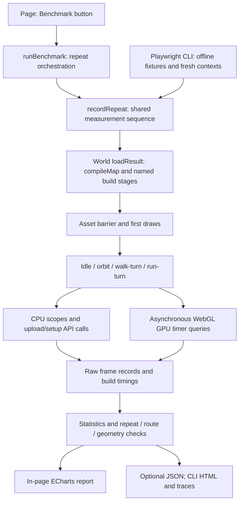

# Benchmark architecture

The map lab has two callers and one shared measurement runner. The page shows results immediately, with optional JSON download. The CLI adds fresh browser contexts, offline fixtures, response hashes and saved artifacts. Both use the same rendering and movement APIs.



## Responsibilities

All paths below are relative to `qa/map-lab/`.

| Component | Owns |
| --- | --- |
| `ui/map-generator.js` | Query session, control locking, cancellation, generation and report display |
| `benchmark/replay-config.js` | Warmup/frame/repeat limits and scenario selection |
| `benchmark/benchmark-runner.js` | Repeat sequence, readiness, profiler lifetime, summaries and metadata |
| `render/map-world.js` | Renderer, camera, simulation, walking queries and scene ownership; no benchmark imports |
| `benchmark/map-benchmark.js`, `scenarios.js` | Development adapter, temporary scope wrappers, deterministic replay and versioned scenario registry |
| `benchmark/scene-metadata.js`, `scene-coverage.js` | Environment/settings and visible geometry audit, collected outside measured frames |
| `render/render-plan.js` | Estimated model preparation with immutable source merge and separate render decisions |
| `pipeline/map-build.js` | Disposable scene compilation and named build stages |
| `pipeline/build-stages.js`, `ui/build-progress.js` | Shared stage consumption; paint waits and stage labels |
| `pipeline/worker-build.js`, `map-build-worker.js`, `render/scene-wire.js` | Worker lifetime, measured transfers, chunked scene restoration and cancellation ownership |
| `pipeline/building-match.js` | Building identity validation, sampled overlap and explicit rejection evidence shared by both views |
| `render/prop-placement.js`, `render/feature-visibility.js` | Rigid prop placement on visible walking surfaces at build and supporting-layer changes; records estimated bases and placement logs |
| `benchmark/frame-profiler.js` | CPU scopes, asynchronous GPU queries, upload/setup call instrumentation and cleanup |
| `benchmark/frame-report.js` | Statistics, source fingerprinting and comparison/coverage validation |
| `benchmark/frame-chart-data.js` | Non-overlapping CPU stack segments and representative p95 frame selection |
| `benchmark/frame-report-view.js` | Shared in-page/exported report UI and detailed tables |
| `benchmark/frame-charts.js` | ECharts legend toggles, activity filtering, duration bars and timeline zoom |
| `qa/map-lab/tests/map-frame-profile.mjs` (repository root) | CLI browser lifecycle, fixture loading, asset hashes, optional traces and saved reports |

## Measurement boundaries

Source acquisition records duration, retries and outcomes separately. Each benchmark repeat then rebuilds the selected data, measures named CPU stages, waits for tracked assets, records first draws, and runs warmup plus measured frames for each scenario. Warmup and first draws do not enter steady-state activity summaries. UI repeats share one context; CLI repeats use fresh contexts. Neither guarantees a cold driver cache.

Generate 3D and interactive benchmark rebuilds run the shared compiler in a module worker. Geometry buffers transfer without numeric JSON repacking, and the main thread restores objects in batches before swapping the completed world. Build cancellation terminates the worker or disposes the partial restored world; the previous scene remains owned until replacement. The scene wire supports the current untextured geometry contract and explicitly rejects unsupported material or geometry channels. Synchronous model/CLI callers retain the same compiler. Settings record `execution` so different execution paths cannot become interchangeable baselines.

[`compiler-input.js`](../pipeline/compiler-input.js) sends source vector `data` and `metadata` without duplicating unused raw response/binary archives, decoded point-record bytes or rejected-acquisition evidence into the compiler worker. Point asset summaries retain decoder/count/layout/checksum metadata. Normalization/modeling currently consumes those explicit channels. Scene restoration reattaches complete original snapshots, lossless point archives and rejected evidence to `plan.observations`, including disabled providers; renderer queries decode intersecting tiles. Existing decoded-base64 captures remain readable. Nothing is deleted from acquisition, downloads or renderer provenance. A future compiler that interprets point records or original curves must explicitly extend this input contract to carry the channels it consumes. This copy-cost correction does not diagnose or recover a crashed browser.

Progressive preview loads reuse unchanged OSM and regional SVG geometry. A changed source rebuilds only its group and owned listeners; changed OSM data or area/projection rebuilds the preview. Each load resolves source observations only and attaches current full provenance, even if geometry is unchanged. Render preparation is deferred to Generate 3D in the worker. This reduces measured DOM replacement work, not source coverage or the historical crash scope. Source resolution and mask/log work still run on the main thread.

The live decision inspector refreshes selected JSON from the current record on each update. Selection follows the original record owner and phase, because associated observations can share a canonical group. Result rows share one owned delegated click listener; replacement buttons retain no callbacks. Ambiguous merge candidate counts are tallied once while collecting pairs, preserving the same associations and conflicts without repeated scans of all accepted pairs.

Untextured inspection meshes use the shared [Lambert material rule](../render/map-material.js) after an identical-geometry hardware GPU comparison. Colors, side settings and instancing remain intact; the shader models diffuse lighting rather than measured physical finishes. Render policy versions distinguish this change from earlier performance baselines. Short controlled timing evidence does not establish a frame guarantee for every map; verify the actual scene and full replay preset.

Depth-path experiments also require occlusion precision checks with both draw orders and thin distant surfaces. The current logarithmic depth path remains: a reversed-depth experiment improved timing on this GPU's default framebuffer but failed those precision checks. A floating-point depth target passed the precision test but increased total measured draw cost, including presentation. Neither experiment changes production depth or antialiasing settings; scoped evidence is linked from the [fidelity review](REVIEW-FIDELITY-2026-09-28.md).

Build `phases` accumulate repeated hydration batches; `threads` identifies worker and main-thread work. Transfer and serialization have separate measured phases. `totalMs` sums stage work; `wallMs` includes progress painting/scheduling, and `yieldMs` records remaining elapsed time. These fields do not establish synchronized cross-thread CPU occupancy. The caller finishes panel layout before the environment observer pins canvas dimensions; later changes still invalidate measurement. The loader is hidden before first-draw and replay measurements. Preview resolution, input structured cloning, object restoration and final visibility/scene setup still execute on the main thread; inspect measured costs for large captures.

CPU ground and collision scopes sit inside simulation; simulation, controls and render submission sit inside the loop. Chart stacks remove those overlaps and use one actual frame at the loop's 95th percentile, rather than adding unrelated stage percentiles. The GPU bar shows its own 95th percentile. CPU/GPU bars compare durations; GPU start timestamps and actual overlap intervals are not captured. The red line is the 16.67 ms target for 60 FPS, not guaranteed compositor headroom.

GPU texture sampling remains part of total shading time. Texture/buffer upload columns measure CPU API calls, not separate GPU transfer durations. Unsupported, disjoint or otherwise missing GPU samples are unavailable, never zero. The timeline lets users inspect outliers and frame cadence separately.

Charts load after profiling completes. Their observers and ECharts instances are disposed before another run. The runner drains or discards pending GPU queries and restores instrumented APIs on completion, cancellation and failure. Hidden-page UI benchmarks cancel.

## Logs and artifacts

| Output | Contents | Lifetime |
| --- | --- | --- |
| Source responses | Queries, raw features, original tags and provenance | In-memory session; explicit per-source downloads |
| Merge log | Policy version, source members, selected attributes, conflicts and coverage | In-memory session; explicit download |
| Generation log | Settings, acquisition timings, build stages, separate source/render decisions, issues and model estimates | In-memory session; explicit download |
| Benchmark report (schema 5) | Raw frames, summaries, builds, environment, settings, route/geometry identities and input fingerprint | Displayed in-page; optional JSON download |
| CLI artifacts | JSON/HTML reports, screenshots, optional Chrome traces and hashed responses | Ignored `.tmp/map-lab/` |

These are exports, not an incremental dependency graph or per-stage artifact cache. A Make/Gradle-style integration is deferred; no bespoke task/cache framework is being built.

## Extension points and current limits

Add future geometry/material stages to `pipeline/map-build.js` with a named yield before their work, and a human-readable label in `ui/build-progress.js`. Both build callers consume the same sequence; the adapter receives measured stage durations. Register asynchronous assets before profiling and include experiment settings in scene metadata. Add new simulation scopes in the development adapter around actual runtime methods and preserve their nesting when reporting. Add future render passes inside the measured draw scope.

New geographic scenes use the existing query/load API; the CLI accepts `--scene path/to/scene.json`. New routes live in the development registry, without changing the renderer:

```js
const harness = createMapBenchmark(world, {scenarios: {
  ...DEFAULT_SCENARIOS,
  overhead: {version: 1, create(world) {
    world.fit(true);
    return () => null; // No movement; step(timeSeconds) may return walking input.
  }},
}});
const report = await runBenchmark(harness, {options: {modes: ['overhead']}});
```

Scenario setup resets its state; `step` must depend on fixed replay time and saved input, not wall-clock time or randomness. Increment its version when the route changes. A scenario may declare `minimumDistance`; the shared runner validates actual travel for both page and CLI, and reports retain these requirements. Built-in walking modes reject stationary results. Reports retain scenario versions, source fingerprint, render settings, source merge and render policy versions and hardware/browser conditions.

Coverage traverses the scene, including the separately owned base terrain and building outlines, using visible material groups, draw ranges and referenced vertices to record bounds, surface area, line length and point count. Generated ground has the stable geometry ID `terrain`; every generated drawable needs a stable feature identity to participate in the audit. Building solids and their outlines share a feature ID. The audit detects coverage changes but does not prove identical topology or final pixels. Current reports cannot be compared directly with older schemas or captures that lack terrain or outline coverage.

CLI reports also hash source and served assets. JSON exports and labeled CLI files provide history; there is no results database or dashboard yet. A different engine/game scene needs an adapter exposing equivalent lifecycle, input, render and metadata operations.

The current target is untextured geometry. See [WebGL research, isolation and review](./WEBGL-BENCHMARK-REVIEW.md) for release packaging, measurement overhead and remaining validity limits. GPU optimization, texture work, asynchronous preview resolution and remaining main-thread restoration costs need separate measurements. This harness measures the lab only; using it in the real game requires a world adapter and deterministic routes. See [profiling instructions](./MAP-PROFILING.md) and [the documentation index](./README.md).
