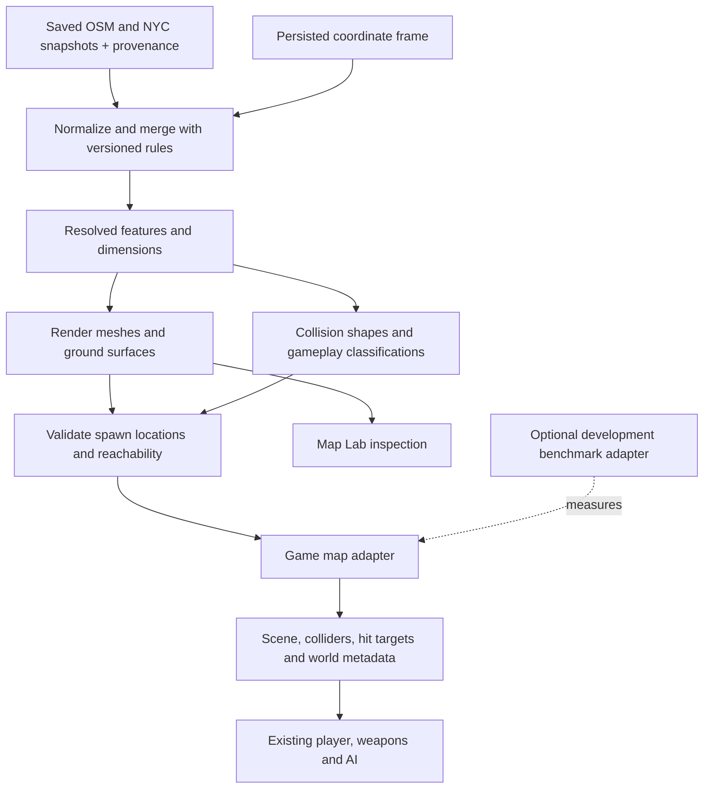

# Generated maps: game interface and coordinate contract

Status: implementation plan, not an available export or game adapter. Map Lab still runs its own viewer; the authored Coney map is unchanged. This document separates existing interfaces from proposed work. Update it as each integration stage lands.

[Open Map Lab](../index.html) · [Documentation index](./README.md) · [Source pipeline](./OSM-PIPELINE.md)

## Objective and boundaries

Make one saved, resolved map plan usable by both the lab and the game. Reuse the game's movement, weapons and combat systems. Start with a separate experimental map; migrating Coney's landmarks, interiors and missions is a later operation.



The compiler must not import the editor, charts, replay or profiler. Shared production modules will need a runtime home outside `qa/`; the lab should import that implementation rather than duplicate it. The current npm release file list excludes QA. Vercel availability of the lab is a separate deployment choice.

## Coordinate contract

### What X, Y and Z mean

Both systems use metres. Y is height. Z is a horizontal map coordinate, not elevation. Negative coordinates simply mean the point lies on the other side of the chosen origin.

| Property | Map Lab today | Authored Coney today |
| --- | --- | --- |
| Horizontal origin | Centre of the returned OSM path coordinates' geographic extent; NYC-only resolution uses query bounds | Fixed origin in the legacy generator |
| Projection | WGS84 ellipsoid projected onto a local tangent plane | Approximate longitude/latitude degree-to-metre factors |
| X/Z orientation | X east, Z south | East/south coordinates rotated to align the local street grid |
| Vertical reference | When active, terrain samples are converted to metres and offset by their median | Authored street/boardwalk reference with explicit beach and platform offsets |
| Stability | Changed input extent can change the origin and elevation samples can change vertical zero | Fixed horizontal frame and authored vertical placements |

Sources: [lab projection and origin](../pipeline/osm-model.js), [NYC-only origin](../pipeline/map-pipeline.js), [terrain reference](../render/map-terrain.js), [legacy Coney generator](../../tools/osm-coney.py), [Coney ground and gameplay](../../../src/world/maps/coney.js).

### Yes, the generated map can be rotated

The following describes the current legacy generator. Keep its constants and worked example together here; consult the linked source when changing them.

```text
Legacy origin: latitude 40.5745, longitude -73.9800
theta = 8.33 degrees
east  = (longitude - originLongitude) * 111320 * cos(originLatitude)
south = -(latitude - originLatitude) * 110540
x = east * cos(theta) - south * sin(theta)
z = east * sin(theta) + south * cos(theta)
```

Trigonometric functions take radians. The legacy generator rounds its final coordinates to a tenth of a metre. Before rotation, going north makes Z decrease. After rotation, Z combines east/west and north/south displacement: it measures along the rotated map grid rather than true south. For example, a displacement of `east = 100 m, south = 0 m` becomes approximately `x = 98.945 m, z = 14.487 m` before rounding. Its length stays 100 m; rotation does not change scale.

For this specific X/Z formula, a Three.js group rotation is `rotation.y = -theta`, because Three.js's positive Y rotation has the opposite sign in the X/Z plane. Rotate around the intended origin, then translate to the target origin. Do not round to a different angle when matching the existing map.

Rotation alone does not align the two current maps: they also have different origins and slightly different geographic projection scales. An affine rotation/translation is useful for approximate inspection, but matching the old geographic data requires its full projection, or regenerating both datasets through one common projection. Hand-authored objects may still intentionally differ from measured geography.

### Proposed frame policy

- A new independent game map keeps the lab's geographic orientation. Persist its chosen origin; do not recalculate it from a later fetch or filter selection.
- A Coney migration chooses either the exact legacy projection for compatibility or a shared modern projection with migrated authored placements. Record the choice explicitly; do not silently mix them.
- Persist the vertical reference separately. Y describes an elevation relative to that reference; building height describes a distance above its base. They are not interchangeable.
- Use source IDs or geographic anchors for authored additions where possible. Save local coordinates with a frame identifier when geography is unavailable.

Proposed frame metadata: `frameId`, projection ID/version, origin latitude/longitude, units, axis convention, rotation with a defined sign convention, and vertical reference including source/datum, offset and verification status. This metadata does not yet exist as a complete game export contract.

### Everything must use the same frame

Apply conversion to meshes, instances, collision shapes, spawn positions, headings, bounds, minimap paths, cover normals, platforms and gameplay anchors. A cosmetic scene-group rotation changes only rendering unless these other representations are converted too.

The lab's [surface index](../render/map-surface-index.js) caches world-space triangles. If meshes are transformed, rebuild that index after updating world matrices, or wrap its queries with the inverse coordinate conversion. For a pure horizontal transform, a game ground query must convert `(gameX, gameZ)` back into the sampler's frame and apply the agreed vertical offset to its result. Transform headings and normals as directions, without translating them.

Axis-aligned collision boxes also need to be generated in the final frame. Rotating a box and taking its bounding box can block empty space. Recompute playable bounds from transformed geometry, not just the old minimum/maximum pair.

## Existing game interface

The [map registry](../../../src/world/maps/index.js) imports modules exporting `meta` and `build(world)`. The [world host](../../../src/world.js) creates `world.W`, calls the builder and exposes the result as `ctx.world`.

| Interface | Existing purpose | Adapter responsibility |
| --- | --- | --- |
| `meta` | Map identity and presentation/environment hints | Stable map ID and appropriate metadata |
| `world.scene.add(...)` | Visible objects | Add generated meshes and suitable lighting; exclude inspection overlays |
| `W.bounds` | Playable world-space extent | Finite bounds covering the intended playable area |
| `W.groundHeight(x, z)` | Base/supporting ground height | Query terrain and supported ground-level surfaces in the game frame |
| `world.box(min, max)` | Add a world-space AABB to `ctx.colliders` | Generate movement obstacles from resolved features |
| `world.solid(mesh, surface, options)` | Register raycast target, optional AABB and shadows | Register bullet/visibility targets; disable its automatic box when supplying custom colliders |
| `world.walkable(min, max)` | Collider also registered as an elevated AI-walkable platform | Represent supported platforms separately from base ground |
| `W.playerSpawns` | Player start/respawn positions | Valid `THREE.Vector3` positions at feet height, with body clearance |
| `W.enemySpawns` | Enemy placement candidates | Valid, reachable positions for enabled combat modes |
| `world.cover(...)` / `W.coverPoints` | Tactical positions and facing normals | Useful positions near blocking geometry, checked for clearance |
| `W.surfaceAt(position)` | Surface classification for game effects | Translate source/material categories to supported game surface names |
| `W.poses` | Named camera/player inspection positions | Optional reproducible spawn and review views |
| `W.mapRoads`, `W.mapLabels`, `W.mapPOIs` | Minimap content | Optional display data transformed into the same frame |
| `W.vehicleSpots`, `W.onlineStart`, `world.ladder(...)`, `world.updaters` | Additional gameplay features | Supply only when those features are deliberately supported |

`world.solid()` does not add a mesh to the scene. Its default collision is the object's entire world-space bounding box, which is unsuitable for a concave building or a batch containing unrelated objects.

The host currently calls `map.build(world)` synchronously. Load snapshots before that call, or explicitly change the host to await construction. The map's geometry, ground queries and collision registrations must be ready before dependent player/AI initialization. Do not fetch new live source data independently on each multiplayer client.

## Generate physics alongside rendering

The [player controller](../../../src/player/collision.js) uses a vertical capsule against axis-aligned boxes. Bullet and AI visibility rays use registered meshes. These representations have different jobs and should retain the same canonical feature IDs for diagnostics.

| Resolved feature | Proposed movement representation | Important constraint |
| --- | --- | --- |
| Simple rectangular building | Solid box from base to top | Use its actual ground placement and height |
| Concave building / courtyard | Multiple boxes approximating occupied polygon regions | Preserve holes and passages; one enclosing box fills empty space |
| Angled wall / fence | AABB segments approximating its thickness | Set and log an error tolerance; avoid arbitrary overblocking |
| Tree | Trunk obstacle | Do not make the entire crown solid by default |
| Bench / street furniture | Simple feature-sized obstacles | Generate per feature, not one collider for an entire instanced batch |
| Ground / road / sidewalk | Ground surface sampler; explicit edge obstacles where needed | Support, visual triangles and step behaviour must agree |
| Bridge / elevated platform | Separate floor/collider and walkable registration | A single ground height cannot represent both levels |
| Reference-only feature | No physical obstacle until classified | Diagnostic dots and administrative lines are not game objects |

The shape policy above is proposed. Polygon-to-AABB decomposition for arbitrary generated footprints is not implemented by this document. It must preserve passable openings within a declared tolerance; cases it cannot represent should be reported rather than silently replaced by enclosing boxes. Exact slanted boundaries would require a richer collision system and matching navigation support.

Keep render geometry independent of physics approximation. Do not simplify the visible footprint just to fit the current collider format. Missing-height buildings follow the existing skip-and-log policy; do not invent an invisible full-height obstacle for an unrendered building.

The lab's current walking helper only blocks against building outlines. It is not the game collision system. Its surface query selects the highest eligible surface at X/Z, so it must not be used as a bridge/interior floor selector without additional level handling.

## Navigation and gameplay

The [AI navigation grid](../../../src/ai/nav.js) already derives navigation from `W.bounds`, `W.groundHeight`, colliders and walkable platforms. An adapter does not need to hand-populate a graph for every road. It does need to validate connectivity, floor transitions and reachable spawn candidates after generating physics.

The current navigation builder limits oversized maps to a centred 1,200 m square and coarsens cells to its node budget. Those implementation limits are in `NavGrid.build()`. Large generated areas cannot promise AI coverage everywhere until navigation is extended or the playable region is constrained explicitly.

Start with walking and weapon impacts, with AI disabled. Enable combat after enemy spawns, navigation and cover checks pass. Add vehicles, multiplayer and Coney-specific missions as separate integration stages. Existing Coney gameplay uses authored coordinates and sometimes geometry-specific assumptions; applying one coordinate transform does not automatically repair entrances, terrain contact or routes.

## Proposed artifacts and diagnostics

No new task runner is required for this work. Extend the existing named compiler stages and exported diagnostics. Reuse existing hashes/version metadata where applicable.

| Output | Contents / checks |
| --- | --- |
| Map manifest | Map ID, source snapshot hashes/provenance, frame, settings and rule/compiler versions |
| Resolved plan | Canonical features, retained source source identity/measured selections and separate render estimates/skips |
| Physics data | Collider records, supporting surfaces, feature IDs and approximation policy |
| Gameplay data | Validated spawns, optional cover/anchors and supported modes |
| Stage diagnostics | Duration, input/output counts, exclusions, failures and source-linked reasons |
| Runtime resources | Disposable meshes, query indexes and generated navigation; no profiler dependency |

Persist serializable inputs/plans/physics descriptions as appropriate; Three.js objects and JavaScript sampling functions are runtime resources, not a portable JSON export. Define ownership and disposal when implementing the adapter. Saving the current generation log alone does not create a playable-map artifact.

## Implementation and acceptance gates

1. **Frame:** introduce persisted frame metadata and explicit forward/inverse conversion. Verify geographic control points, east/south signs, rotation sign, distance preservation for rigid transforms, and vertical reference. An extended query must not move previously anchored objects.
2. **Runtime boundary:** extract the reusable compiler to a runtime location, keep one implementation, and retain the benchmark-import/release-isolation checks. Add a separate experimental map entry.
3. **Physics:** generate colliders and register raycast targets. Verify a rectangle, an L-shaped footprint, a courtyard, a rotated building, a narrow passage, instanced props and stepped terrain.
4. **Basic play:** wire bounds, ground queries and validated feet-level spawns. Walk, run, jump and shoot with the real controller. Check wall contacts, bullet hits and that excluded/reference features do not become invisible obstacles.
5. **AI:** generate/validate enemy spawns and cover; build existing navigation. Verify routes and disclose unsupported regions/levels. Measure navigation generation and memory separately from mesh generation.
6. **Performance and reproducibility:** run fixed input snapshots and routes in the actual game. Record build, collision, navigation, simulation and render costs through an external development adapter. Lab-only frame timings do not establish full-game performance. Multiplayer must agree on map content and frame.
7. **Coney migration:** map authored landmarks and gameplay anchors into the chosen frame, explicitly replace duplicate generated features, and regression-test entrances, elevators, subway platforms and missions.

Open decisions: final shared runtime directory, serialized artifact schema/versioning, collider approximation tolerance and handling of stacked surfaces. No automatic export, navigation expansion or authored-Coney replacement is implemented yet.
