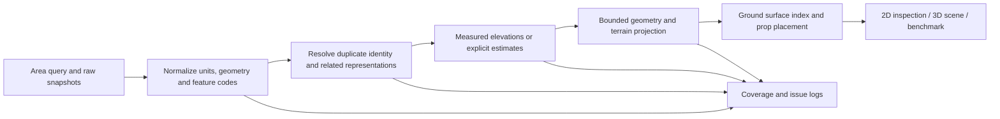

# Infrastructure geometry and elevation

The source registry in [map-sources.js](../data/map-sources.js) drives fetching, filters and downloads. All queries request complete properties and geometry. Normalization assigns physical roles; merging associates only compatible records; generation emits simple untextured geometry. Source snapshots remain unchanged. The rectangle selected in the picker bounds both views, even when a service returns whole intersecting features.

## Connected layers

Dataset links open the provider. The Help source table links the exact area-query URL. Each request is also recorded in its downloadable snapshot. These are Socrata GeoJSON endpoints using the same paginated `intersects` query as the original city sources.

| Layer | Dataset | Geometry use |
| --- | --- | --- |
| Transportation structures | [r9cu-9r7b](https://data.cityofnewyork.us/d/r9cu-9r7b) | Bridge, rail bridge, viaduct, pedestrian bridge and overpass footprints; tunnel outlines |
| Railroad lines | [anc7-97cy](https://data.cityofnewyork.us/d/anc7-97cy) | Separate track alignments and physical classifications |
| Railroad structures | [dwer-xbgx](https://data.cityofnewyork.us/d/dwer-xbgx) | Station outlines; simple terrain-following entrance and ventilation footprints |
| Retaining walls | [s2pi-ccum](https://data.cityofnewyork.us/d/s2pi-ccum) | Simple wall beams on mapped alignments with logged dimension estimates; measured matching OSM walls take priority |
| Boardwalks | [p9cw-7gsv](https://data.cityofnewyork.us/d/p9cw-7gsv) | Terrain-following footprint, estimated vertical placement |
| Shoreline | [59xk-wagz](https://data.cityofnewyork.us/d/59xk-wagz) | Reference line |
| Hydro structures | [6hbv-tek4](https://data.cityofnewyork.us/d/6hbv-tek4) | Pier, jetty and seawall surface tops from recorded absolute elevation |
| Hydrography | [pjs3-c3z5](https://data.cityofnewyork.us/d/pjs3-c3z5) | Beach/wetland terrain surfaces; water outlines pending measured level |

## Field use

- `feat_code` and `sub_code`: physical role, eligibility for elevation association, ground versus elevated/reference rendering. Unknown codes retain outlines and produce issues.
- `elevation`: NYC feet converted to metres. Bridge spot samples constrain compatible deck footprints; hydro-structure values describe surface tops. Ground spot samples alone feed terrain. Roof samples never become bridge or ground readings.
- `source_id`, dataset, canonical geometry/attribute fingerprint and original properties: identity, provenance and review. Repeated IDs retain distinct observations even when coordinates match; object-key order does not change the fingerprint.
- OSM `gauge`: a single numeric value is millimetres. Corridor `width` is not rail gauge. Missing/multiple/invalid gauges use a logged standard-gauge estimate.
- OSM `bridge`, `tunnel`, `layer`, `level`, `location`: classification, not numeric height. Negative layers express relative ordering and do not establish underground placement; an explicit bridge can have a negative layer. Shared [physical-level rules](DATA-LAYERING.md) keep unsupported floors/locations and tunnels out of ground matching, observations and walking geometry. A ground-level building passage is distinct from an underground tunnel.
- OSM dimensions, NYC building heights/base elevations and LION widths retain the existing rules documented in the Help merge catalog. Curb associations collect all compatible height claims before selection: numeric measurements take priority over classification estimates; conflicting claims of equal priority remain separate with no selected height. Contradictory lower-priority alternatives also remain visible and logged.
- Names, survey/status fields, shape area/length and other unused properties remain available in source and merge downloads. They do not justify new physical dimensions by themselves.

GeoJSON coordinate validation is shared by normalization, preview and terrain. A malformed record stays in the raw snapshot and produces an `invalid-geometry` coverage/log entry; it contributes no partial geometry. Valid sibling records continue through the pipeline. Valid MultiPoint records expand into independently identified points; an invalid MultiPoint remains one skipped source record.

“Use all data” means preserving and interpreting fields according to their meaning, not assigning every field to a mesh dimension. Materials/colors, service routes and ownership metadata remain available for later pipeline stages.

## Vertical resolution

The implementation is [infrastructure-merge.js](../pipeline/infrastructure-merge.js); its exported `STRUCTURE_RULES` is the source of thresholds. It records selected sample IDs, converted values, interpolation method, estimate flags, conflicts and related structure IDs.

1. Associate each bridge sample with exactly one containing transport polygon, respecting holes. Multiple containing structures are ambiguous and do not acquire that sample.
2. Reject conflicting co-located readings and insufficient distinct observations. Check both perimeter and interior support within the requested area.
3. Use four-nearest inverse-distance interpolation only for a supported deck. This is an estimated surface constrained by measured samples, not surveyed continuous deck geometry. Support limits are conservative tuning parameters, not source accuracy guarantees.
4. Associate an elevated track or road only when its complete sampled geometry lies inside one compatible supported structure. Unknown NYC rail subtypes, embankments, cuttings and tunnels stay references. A road centreline becomes an elevated reference over its deck instead of generating a duplicate ribbon.
5. Keep deck, roof, tunnel, retaining wall and water roles separate. Missing height produces an outline and issue rather than a guessed solid.

The [NYC capture rules](https://github.com/CityOfNewYork/nyc-planimetrics/blob/main/Capture_Rules.md) describe the planimetric vertical datum as NAVD88 and elevations in feet. Our live Socrata samples contained **2D coordinates**, including for classes whose master dataset is documented as Polygon Z or Polyline Z. We do not treat a source's Z-capable master schema as proof that the downloaded response supplies vertex heights. Ground/deck/hydro alignment remains recorded as provisional because each returned historical record does not carry its own verified datum metadata.

Unknown-height outlines are shown near terrain as inspection aids, not at a claimed physical elevation. Turning off duplicate merging does not disable vertical safety. Source/category filters select inputs before resolution. Cached 3D visibility only hides existing geometry; regenerate to resolve a different source selection.

## Connected road approaches

[road-approaches.js](../pipeline/road-approaches.js) retains the OSM node graph before NYC coverage suppresses road ribbons. A supported bridge endpoint starts a non-bridge, ground-level chain through shared node IDs, including way splits. A branch, network end or another deck ends the chain. Nearby coordinates without shared IDs do not establish a connection.

Deck footprint edges constrain the upper surface. Uniquely associated road spots constrain intermediate heights; spots under decks, ambiguous parallel-road readings and conflicting projected stations are excluded with source evidence retained. The far endpoint follows the existing estimated terrain unless it meets another supported deck. The connecting grade and crossfall remain estimates, recorded as `estimated-road-approach` and in each feature's merge attributes.

Roadbeds receive the profile for uniquely covered centreline intervals; exact intersections retain polygon edges and holes. A way crossing successive roadbed polygons profiles each disjoint portion. Roadbeds covering the same interval are ambiguous and retain their terrain role, with a conflict logged. Other ground alignments within a profiled roadbed retain their terrain role. Uncovered OSM ribbons use the same profile. Deck masks remove duplicate roadbed/ribbon surfaces over the structure, in both views. Non-bridge approaches remain ground-support surfaces for walking, tree exclusions and furniture placement. The rule changes road surfaces, not bare terrain or the crossing road beneath the deck.

The profile does not create embankment volume, side slopes, bridge supports or surveyed banking. Missing topology, ambiguous roadbed coverage and unsupported decks remain limitations. Actual mesh joins are checked separately by [geometry validation](GEOMETRY-VALIDATION.md).

## Rendering and bounds

Whole NYC polygons may extend far beyond the query rectangle. Surface triangles are clipped to the selected bounds after triangulation, preserving concavity, holes and vertex channels. Line paths are clipped before instancing. After placement, edge-crossing instances receive individually clipped meshes; interior instances remain batched. Solid cuts receive side caps. The 2D view clips every displayed layer to the fetch boundary. Full raw geometry remains available in source downloads.

Ground surfaces share the existing terrain lattice. Elevated decks use their independent elevation profile; hydro surfaces use their recorded absolute elevation relative to the local ground datum. Line beams tilt between endpoint elevations. Tagged elevated/underground OSM platforms, barriers and props without a supported role-specific height stay outlines or markers; containment inside a road deck cannot supply their height. OSM and NYC water remain outlines until a compatible water level is available. These are basic meshes without textures, inferred structural thickness, piers, trusses or platform roofs.

Elevated surfaces are excluded from the ground index used for prop placement and default spawn. A separate support index includes roof/deck tops for Walk here and falling. Its height ceiling prevents snapping a person from the ground onto an overhead deck. Full collision/navigation integration remains future game-adapter work; see [physics comparison](PHYSICS-COMPARISON.md).

## Remaining geometry work

- Station roof/platform separation, support columns, deck thickness, tunnel profiles and surveyed retaining-wall dimensions need more measurements. Wall/fence shapes use logged per-kind defaults today.
- Sparse bridge measurements do not recover banking, crossfall or every ramp. Unsupported spans remain references; interpolation can smooth abrupt profile changes.
- Water outlines require compatible water-level measurements and a terrain/water boundary rule. Ground terrain is not yet cut away beneath water or structures.
- Coastal/boardwalk and elevated-track cross-source identity matching is conservative. Same-role overlays can remain separate; we do not erase one solely because it intersects another. Ground track/wall suppression requires a unique mutually coincident full-length match and explicit OSM ground level.
- OSM roof shapes, steps, road markings, curb ramps, track switches and several material/direction semantics still need geometry rules. Existing defaults are estimates, not new survey data.
- Large-area generation still runs synchronously on the main thread. These changes bound new source geometry, but do not introduce a worker build pipeline.

## Verification

Run `tests/infrastructure-test.mjs` and `tests/road-approaches-test.mjs` with Node 22+ for units, association ambiguity, missing/conflicting elevation, tunnel separation, clipping holes, source immutability, ordering, gauge, connected approach profiles and walking uphill/downhill across drawn seams. Browser regression scripts use the shared Chrome launcher under Xvfb; see [profiling instructions](MAP-PROFILING.md). `tests/map-capture.mjs` obtains fresh responses through the real page. The historical pinned fixture is intentionally unchanged and remains distinct from live acquisition.

Primary references: [NYC capture rules](https://github.com/CityOfNewYork/nyc-planimetrics/blob/main/Capture_Rules.md), [OSM gauge specification](https://wiki.openstreetmap.org/wiki/Key:gauge), [Socrata intersects](https://dev.socrata.com/docs/functions/intersects.html).
