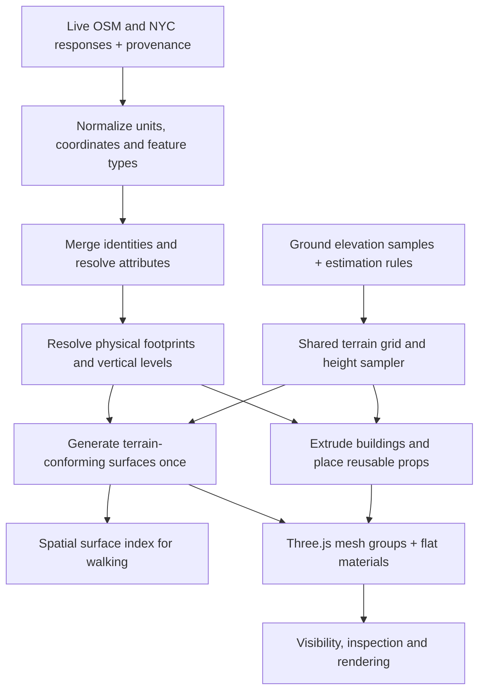

# Map geometry: implementation research and proposed design

Start with the [unified local generator](../index.html): choose bounds or Auto Coney, inspect/filter 2D, Generate 3D, then Benchmark. The [Help & pipeline](../index.html#pipeline) page documents usage, source APIs, rules, dependencies and remaining work. The lab is enabled on Vercel; local scratch data in `.tmp/` remains excluded.

Researched 26 September 2026. Keep Three.js and our custom OSM + NYC generator. The approaches below are verified in upstream source; their combination is our project recommendation. There is no single industry standard that specifies how to turn these datasets into a walkable world.

Status: the first optimization pass is implemented locally: direct indexed base terrain, one surface-projection pass, spatial walking queries, reusable geometry for visibility, and skipped idle orbit draws. The [headed Chrome review](./MAP-PERFORMANCE-REVIEW.md) contains before/after measurements. Ground-coverage extensions, additional curb geometry, workers and bridge navigation below remain future work. No external renderer was installed, integrated or benchmarked against our scene.

## What the implementations actually do

### OSM2World: resolve ground coverage before generating surfaces

`WorldObject.getGroundFootprint()` subtracts higher-priority footprints from lower-priority areas when both occupy the ground. Roads, physical surface areas, explicit landcover, implied landcover and background terrain have different priorities. Holes participate in subtraction. This is useful for a road passing through a park: park coverage should not create a competing surface over the road. [Pinned source](https://github.com/tordanik/OSM2World/blob/8ec26a9ea426444a4f7882cf0cfcab432c876ae5/core/src/main/java/org/osm2world/world/data/WorldObject.java)

Its surface module triangulates the resolved footprint with additional elevation points. Conversion creates world objects, interpolates elevation at connectors and invokes a configurable elevation calculator. A constraint-based calculator is available; this inspection does not establish it as the default. The current triangulation utility dispatches to Earcut4J, so describing the whole pipeline as constrained Delaunay would be inaccurate. [Surface generation](https://github.com/tordanik/OSM2World/blob/8ec26a9ea426444a4f7882cf0cfcab432c876ae5/core/src/main/java/org/osm2world/world/modules/SurfaceAreaModule.java), [conversion](https://github.com/tordanik/OSM2World/blob/8ec26a9ea426444a4f7882cf0cfcab432c876ae5/core/src/main/java/org/osm2world/O2WConverterImpl.java), [triangulation](https://github.com/tordanik/OSM2World/blob/8ec26a9ea426444a4f7882cf0cfcab432c876ae5/core/src/main/java/org/osm2world/math/algorithms/TriangulationUtil.java)

Road geometry uses lane layouts and connections. Width selection tries complete lane widths, explicit road width, lane estimates, then defaults. These are reconstruction rules, not newly measured street dimensions. Our valid NYC roadbed polygons should remain the horizontal geometry source where matched; width-generated roads fill uncovered areas. [Road module](https://github.com/tordanik/OSM2World/blob/8ec26a9ea426444a4f7882cf0cfcab432c876ae5/core/src/main/java/org/osm2world/world/modules/RoadModule.java)

Limit: the overlap code itself notes that generated wide roads can overlap even when their original OSM elements do not. We should detect overlaps on resolved physical footprints. Also, its area elevation helper can scan triangles; it is not evidence that every OSM2World height query uses an acceleration structure. [Area implementation](https://github.com/tordanik/OSM2World/blob/8ec26a9ea426444a4f7882cf0cfcab432c876ae5/core/src/main/java/org/osm2world/world/data/AbstractAreaWorldObject.java)

### Streets GL: conform geometry to terrain triangles, then sample elevation

`GeometryGroundProjector` intersects input triangles with terrain triangles, rejects degenerate results and triangulates the remaining convex pieces. It preserves interpolated attributes such as UVs. Candidate cells are found from covered row spans rather than visiting an entire rectangular bounding box. Its caller processes original triangles without our extra recursive 20 m subdivision. [Projector](https://github.com/StrandedKitty/streets-gl/blob/2412c8ea85ea221356f0fe103e7a412743224120/src/lib/tile-processing/tile3d/builders/GeometryGroundProjector.ts), [caller](https://github.com/StrandedKitty/streets-gl/blob/2412c8ea85ea221356f0fe103e7a412743224120/src/lib/tile-processing/tile3d/builders/utils.ts), [cell traversal](https://github.com/StrandedKitty/streets-gl/blob/2412c8ea85ea221356f0fe103e7a412743224120/src/lib/math/MathUtils.ts)

The projected vertex shader samples terrain heights and interpolates within a terrain triangle. Its CPU terrain-height provider similarly selects a cell triangle and interpolates three heights instead of raycasting the whole visible world. The provider supports missing-data/fallback behavior; it is a terrain query, not a complete character controller or bridge collision system. [Shader](https://github.com/StrandedKitty/streets-gl/blob/2412c8ea85ea221356f0fe103e7a412743224120/src/resources/shaders/projected.vert), [height provider](https://github.com/StrandedKitty/streets-gl/blob/2412c8ea85ea221356f0fe103e7a412743224120/src/app/terrain/TerrainHeightProvider.ts)

This validates the shared-triangle approach, not our current implementation cost. Streets GL also uses workers and terrain detail levels. Its projected output uses triangle buffers; indexed geometry is not a universal requirement for every surface. [Worker](https://github.com/StrandedKitty/streets-gl/blob/2412c8ea85ea221356f0fe103e7a412743224120/src/app/world/worker/MapWorker.ts)

### MapLibre: paint flat map layers onto reusable terrain

Eligible fills, lines, backgrounds and raster layers render into cached per-tile textures, which are draped over terrain. Changed data/style fingerprints invalidate those textures. Terrain uses reusable indexed grid geometry, with skirts to cover tile seams. [Texture pipeline](https://github.com/maplibre/maplibre-gl-js/blob/d274f3db368c8490d33e4c1ef4793f31c489091b/src/webgl/render_to_texture.ts), [terrain geometry](https://github.com/maplibre/maplibre-gl-js/blob/d274f3db368c8490d33e4c1ef4793f31c489091b/src/render/terrain.ts)

This is useful later for road paint and flat appearance layers. It does not provide raised sidewalk solids, building volumes or walkable collision geometry. For the current untextured scene, assign flat materials to resolved surface regions.

### Cesium and Epic: useful patterns with different purposes

Cesium's ground primitives drape geometry onto terrain/3D Tiles and support asynchronous construction. Epic's landscape splines coordinate road meshes with landscape height and blend layers; decals modify surface appearance. These support separating terrain, physical geometry and paint. They do not specify our dataset merge rules or guarantee surveyed curb elevations. [Cesium](https://cesium.com/learn/cesiumjs/ref-doc/GroundPrimitive.html), [Epic landscape splines](https://dev.epicgames.com/documentation/en-us/unreal-engine/landscape-splines-in-unreal-engine), [Epic decals](https://dev.epicgames.com/documentation/en-us/unreal-engine/decal-materials-in-unreal-engine)

## WebGL rendering and profiling boundaries

The [WebGL review](./WEBGL-BENCHMARK-REVIEW.md) records the engine/browser guidance used here: reusable resources, instancing, bounded draw work, explicit disposal and independent measurement. Profiling diagnoses the pipeline; it does not dictate terrain accuracy or justify reducing geometry without a fidelity check. Renderer code imports no benchmark modules. Future material/texture stages belong in scene compilation, with readiness barriers in the development adapter and settings in report metadata.

## Proposed pipeline for this project

1. **Preserve the existing merge contract.** Resolve identity separately from ground coverage. Every generated piece retains canonical feature ID, source IDs, rule version, chosen dimensions and estimate flags. Subtracting an occluded patch changes its representation, not its source record or identity.
2. **Resolve competing surface footprints.** Compare physical polygons at compatible vertical levels, preserving rings, holes and disconnected pieces. Road/sidewalk conflicts need explicit geometry-quality rules and logged decisions; do not apply a blanket source priority. Broad landcover yields to resolved physical surfaces. Equal-priority ambiguity is logged. Bridges and tunnels require separate levels; an OSM `layer` value alone is not a measured height.
3. **Build the base grid directly.** Use one local metre coordinate system, grid origin, cell spacing and diagonal convention. Generate indexed base terrain directly on that lattice. Do not run an already conforming base grid through the surface projection pass. The present 5 m spacing is a configurable project choice, not a source accuracy claim or industry standard.
4. **Project surfaces once.** Triangulate resolved footprints with holes, then intersect those original triangles only with touched terrain cells/triangles. Remove recursive pre-subdivision. Cache grid heights and edge intersections with a consistent tolerance so adjacent pieces agree. Preserve sharp curb/material boundaries when sharing vertices. If this still creates too many fragments, evaluate polygon-per-cell triangulation before adding more complexity.
5. **Make physical steps explicit.** Road and sidewalk tops follow the same underlying terrain function plus recorded or estimated offsets. Generate exposed side faces where a raised sidewalk meets a lower surface, respecting shared boundaries and ramps. Curb height remains an estimate until measured data exists. Painted medians remain future appearance features, not raised islands. Keep buildings upright and preserve the strict height/floor-count/skip-and-log policy.
6. **Query the surface model for walking.** Find the terrain cell directly; use a small spatial index for candidate sidewalk/road surfaces and interpolate the applicable triangle. Respect footprint holes, visibility, current support level and permitted step height. Choosing the highest surface globally would incorrectly snap a pedestrian to a bridge or roof. Retain an explicit path for stacked surfaces; a single heightfield cannot represent them.
7. **Cache before adding concurrency.** Cache merged records and mesh groups by input/rule version. Display-only changes toggle group visibility and query eligibility. Changed inputs invalidate affected geometry. After eliminating repeated work, move expensive pure generation into a worker with transferable arrays if needed. Keep existing prop instancing. Add spatial chunks and distance detail levels when scene size justifies them.

Depth bias can help a thin marking overlay, but cannot fix surfaces that physically cross between vertices. Surface ownership and compatible geometry address that failure. [Three.js polygon offset](https://threejs.org/docs/pages/Material.html#polygonOffset)

## Implementation order and acceptance evidence

Implemented: redundant subdivision removed, base lattice generated directly, walking queries indexed, visibility changes reuse geometry. Existing merge masks and geometry rules remain in place; broader ground-coverage resolution and exposed curb boundaries are later extensions. Add materials/paint and larger-area streaming after those foundations work.

The [historical performance review](./MAP-PERFORMANCE-REVIEW.md) records the original before/after geometry, build and walking measurements with their method and limits. Those measurements predate later attribute-preservation and harness changes; record a fresh baseline with the current harness.

Validate each implementation step on the same source snapshots and repeat measurements in **headed Chrome**, recording the reported GPU. Include active walking, frame-time percentiles, generation time, query latency, buffer payload and triangle count. Check footprint holes, source coverage, missing-height errors, terrain separation, shared-edge cracks, curbs, and query agreement with reference rays. The latest local sample achieves sub-millisecond p95 ground lookup; other devices and scenes still need measurement. Do not accept a stationary refresh-limited 60 FPS result as proof of walking performance.

The source revisions in the links above make the inspection reproducible. Downloaded reference files and their manifest live in ignored `.tmp/map-lab/render-research/`; they are research material only. Implementation remains custom and local, with no new dependencies or commits.
