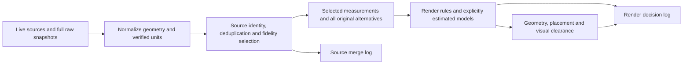

# Source selection and rendering

Source merge collects measurements and all unique observations, including qualifications on estimates already reported by a provider. It confirms duplicates, selects the best supported geometry/attributes, and records provenance and conflicts. It does not generate estimates, interpolate elevations, extrapolate geometry or generate models. Missing information stays missing.

Rejected/cancelled acquisition evidence remains separate in `observations.acquisitionFailures`, including read adapter responses and completed I3S binary channels. It is available to renderer diagnostics and log downloads, without entering complete provider inventories or source-selection decisions. Worker restoration reattaches the original evidence instead of duplicating it in the compiled scene payload. See [acquisition rules](TRANSPORT-INVENTORIES.md).

“Raw evidence” is a saved provider observation with its identity and context: original API fields and geometry, source metadata/CRS, native ArcGIS Z/M/curves, I3S mesh bytes or LASzip tile bytes plus checksums. It means the renderer can inspect what the provider actually supplied. It does not assert that a bridge inventory point is a pier location, a road vertex's zero Z is pavement elevation, or a LiDAR return is an identified column. Those measured roles and dimensions remain separate gaps until directly verified.

[`resolveSources`](../pipeline/map-pipeline.js) produces the source plan. [`mergePlan`](../pipeline/map-merge.js) selects geometry and measured values according to the [source policy](../pipeline/map-merge-rules.js). `observations.buildings`, `roads` and `details` retain normalized alternatives from enabled providers before representation suppression or coverage trimming. `observations.records` exposes all fetched feature records and their full source snapshots, including provider metadata, original API responses, native bytes, geometry support, unsupported records and disabled providers. Source checkboxes restrict participating candidates while keeping excluded originals available; generated-world visibility hides selected geometry without rerunning identity selection. Inventories share acquired data without editing or discarding channels; source downloads retain the same originals.

Original NYC planimetric references additionally retain geographic XYZ in `sourceGeometry`, with native coordinates and curves in their original response channel. Transit entrance row IDs, station MRNs, survey ramp IDs and program object IDs identify different record roles; shared station/corner IDs do not combine them. [Acquisition status](SOURCE-ACQUISITION.md) records which actual payloads are connected and which interpretation/modeling steps remain deferred. These references do not add inferred grades, heights or supports to the source plan.

The BES building-grade source retains lowest-adjacent-grade and estimated active-floor values, original centroids, BINs and obstruction notes as separate references. Footprint ground elevations and BES grades remain separately attributable observations; source merging deletes neither one. An upstream floor estimate remains qualified evidence, not a measured street grade. See [building-grade acquisition](SOURCE-ACQUISITION.md#building-grade-and-floor-observations).

[`prepareRenderPlan`](../render/render-plan.js) copies selected source features, reads the observation inventory and applies the [render rules](../render/render-rules.js). It preserves the source plan and `merge` log. Its `render.decisions` and per-feature `render.attributes` record derived dimensions, model constraints, interpolation, placement and exclusions. Observation inventories are immutable inputs shared between the plans; the renderer must not edit them.

[Station/LiDAR acquisition](SOURCE-ACQUISITION.md) retains full station records and uniquely identified point-cloud assets in the same inventory. Live cloud assets carry complete lossless LASzip records, decoded validation/checksum evidence and original compressed bytes, with source selection/coverage decisions and no inferred vector geometry. All EPT depths are additive; node envelopes are acquisition bounds. Renderer queries decode intersecting tiles and select exact native XYZ records with optional class/origin filters and preserve all unselected source records. Datum transforms, classification interpretation and reconstruction remain pending; station centroids and structure labels never become measured support objects. Older compressed-only captures remain available without implicit decoding or replacement.

| Source merge retains/selects | Renderer derives |
| --- | --- |
| Actual height and floor-count tags | Floor-count-to-height estimates |
| Recorded widths, lanes and matched LION min/max range | Constant-width road ribbons and lane/default widths |
| Deck outlines, all spot readings, bridge identities, layers and exact node topology | Separate estimated deck/ground profiles, bounded ramp grades and crossfall |
| Actual roof triangles, reciprocal identities and current footprint/base alternatives | Native-versus-current display selection, rigid base placement and a separately flagged collision proxy |
| Building-adjacent grade/floor reports, upstream estimate flags and original BIN/centroid | Compatible building-base evaluation after identity/datum checks; no street-level measurement |
| Independent whole-building and part observations, including original longitude/latitude rings | Complete footprint/base checks and maximum-height retention before parent suppression; shared estimated placement; partial/ambiguous assemblies remain references |
| Tank footprint, base/top/height and BIN | Roof/parent compatibility, envelope model and placement |
| Mapped support outline and tagged height | Open frame, member dimensions, road clearance and terrain base |
| Actual tree positions, all matched alternatives, dimensions, species/status/DBH and tree-row paths | Selection among measured positions using modeled clearance, missing dimensions, row instances and visual surface exclusions |
| Numeric curb measurements and classification tags | Classification-based curb heights, defaults and beam/ramp models |

A recorded building top with only a lower-floor tag retains an unknown measured base. Rendering can estimate that base from floor height, flags the estimated base separately from the measured top, and disables a contradictory extrusion/proxy rather than silently grounding it.

Uncertainty keeps source alternatives. Confirmed duplicates may have one selected representation, but their full geometry and attributes remain available. An estimate from rendering cannot be used as measured evidence to promote a source. Unknown regular train/highway support locations remain gaps; the merge never creates synthetic columns.

[NYSDOT inventories](TRANSPORT-INVENTORIES.md) contribute full roadway/ramp alignments and bridge structural attributes as complementary references. Bridge inventory points are not support coordinates, route measures are not elevation, and zero Z in a geometry channel is not a verified ramp grade. Their merge policy preserves roles and provider identities without creating connectivity, widths or supports.

Fetching and the 2D preview call `resolveSources` only: they never prepare estimated models or apply render exclusions. Generate 3D calls render preparation in the compiler worker; its source merge log remains identical for the same selection. The live log shows source rows during gathering and adds separate render rows after generation. The 2D merge download contains source decisions; the generation download has distinct `merge` and `render` keys. A render-excluded tree remains visible as a source observation in 2D. Generating meshes adds actual placement to render records without changing source decisions.

Acquisition and preview errors have separate labels. A preview failure does not reclassify a complete fetched source as rejected: acquisition timings retain `status: loaded` and the separate preview outcome. Render failures belong to Generate 3D. Source downloads stream complete JSON fields with bounded chunks and backpressure; the lab-scoped download worker handles only attachment URLs. See [acquisition/export limits](SOURCE-ACQUISITION.md).

Summary `matched` counts source decision records with associated alternatives, rather than unique physical identity groups. Both records in a reciprocal dated-mesh association can contribute; the interface labels this metric “matched records.”

[`source-render-boundary-test.mjs`](../tests/source-render-boundary-test.mjs) verifies immutability, alternative retention, missing measured dimensions, independence from render defaults and separate logs against synthetic inputs and both native-roof/tank and bridge captures. Part assembly decisions and native topology audits also belong to rendering. See [fidelity integration](FIDELITY-INTEGRATION.md) for source-specific selection limits and [the source audit](SOURCE-FIDELITY-AUDIT.md) for the dataset inventory.
